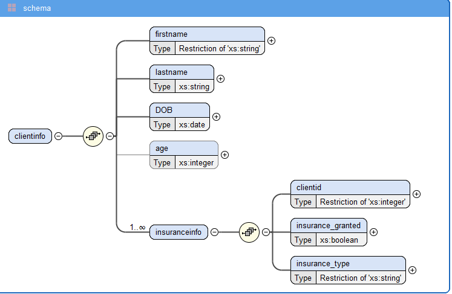
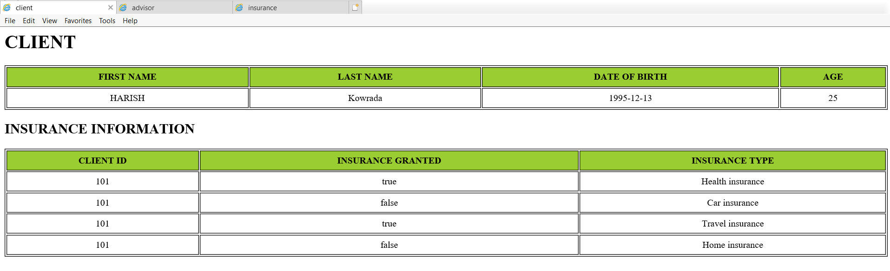
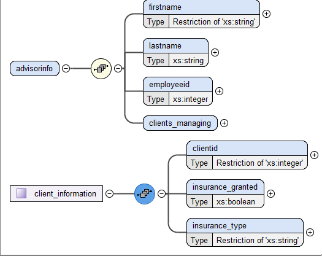
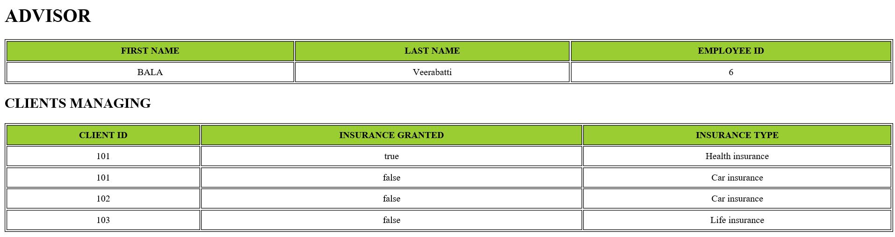
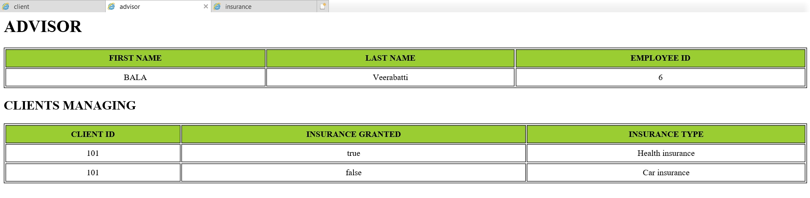
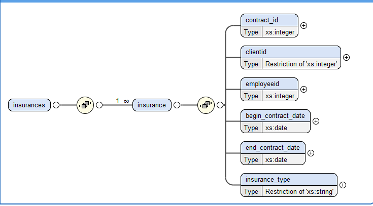
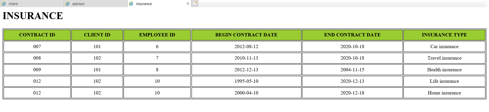
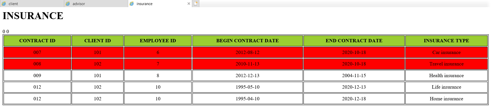

**Data Pipelines – 1**

-   Schema defining rules for storing data for clients and advisors of
    an Insurance company.

-   XML for inserting data respecting the schema rules.

-   XSL file to extract data from xml sheet and apply stylesheet.

An advantage of xml over a standard relation data base is that there is
only single attribute (column) for only one items without changing the
schema or structure of data base. We can have our own customized tags to
deal with the data. Due to this, data extraction is easier using if-test
and when statements. - This is useful to transfer data over the internet
with user defined schema or XSL. The Major disadvantage with XML is that
this is not user friendly. Data stored in the XML file is limited with
respect to the processing of this file.

Here are few scenarios where XSD, XML and XSL showcase their advantages
and disadvantages:

In this example of an Insurance company, we design a data model with
client, advisor, and available insurances in the company.

> **SCENARIO 1 : List the clients and insurance information on them**
>
> 
>
> **clients.xsd:**
>
> We define rules for storing client data – first name should be in
> capitals, so we use a restriction in complex type element. For
> insurance information we a child attribute with the same number but
> maxOccurs will be “unbounded” to tell that one client may have
> multiple insurances. We use a Boolean type to declare if the insurance
> is granted or not – this can be further used while data extraction.
> Then we have another child element for insurance information called
> “insurance type” – this is fixed for the type of insurance available
> in the company.

**clients.xml:**

> We insert data into xml respecting the rules defined earlier. Also
> include xml-stylesheet type to further link it to the xsl file.
>
> **clients.xsl**
>
> With in the xsl file, we create two tables for the above inserted data
> and to navigate to paths where client’s details(/clientinfo) and their
> insurances (clientinfo/insuranceinfo) are located. We use ‘select’
> function and give the respective path. The data will be extracted from
> here, then we wrap everything under ‘for-each’ to apply the template
> to each row in the dataset.

**Output of clients.xml:**

> 

**SCENARIO 2 : List the advisor who managed client with id 101**

> 
>
> **advisors.xsd:**
>
> For the advisors we create rules to put firstname (allcaps), last name
> , employee id. Then we create complextype element – “client
> information” that contains client id between 100 and 9999 - this is to
> show the restrictions that could be imposed by the company. Then we
> create a Boolean element ‘insurance\_granted’ with minOccur=1 – to
> show that a client exists only if insurance is either failed or
> processed. Then we have another child element for insurance
> information called “insurance type” with enumeration – this is fixed
> for the type of insurance available in the company.
>
> **advisor.xml:**
>
> We insert data into xml respecting the rules defined earlier. Also
> include xml-stylesheet type to further link it to the xsl file.
>
> **advisor.xsl:**
>
> We create two tables one for Advisor information and one for list of
> clients managed by the advisor. To extract the clients with id ‘101’
> we first put the path to client info from inside advisor info and use
> “if test” on it.
>
> **List of all clients managed by Employee ID 6 (without if test)**
>
> 
>
> **List of clients with client id 101 (with if test)**
>
> 
>
> **SCENARIO 3 : List all the insurances and the mark the one’s expiring
> on 18-Oct-2020.**
>
> 
>
> **insurance.xsd:**
>
> We create a set of rules for storing insurance data like start date
> and end date and enumeration restriction on insurance types to only
> accept data from available insurance types.
>
> **insurance.xml:**
>
> We input data respecting the rules created earlier.
>
> **insurance.xsl:**
>
> To do this, we upgrade the stylesheet to version 2.0, then we navigate
> to insurance inside insurances. Use if-test here to extract only
> insurances ending on the given date and apply bgcolor, but this paints
> the entire table since it is in the main table tag, to paint only
> specific rows, we use a “if-test” with not keyword to get the entire
> table – this preserves the previous style but extracts all the rows.

**All Insurance:**

> 
>
> **Insurance expiring on 2020-10-18:**
>
> 
>
> **Tools used:**
>
> <https://codebeautify.org/>
>
> <https://www.freeformatter.com/xpath-tester.html#ad-output>
>
> Oxygen xml editor
>
> Internet explorer – to view xml visualization
>
> Saifuddin Mohammad – DE – S20 – DSTI
